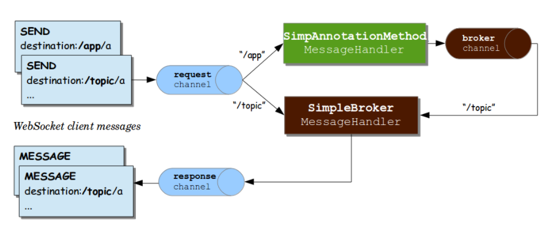
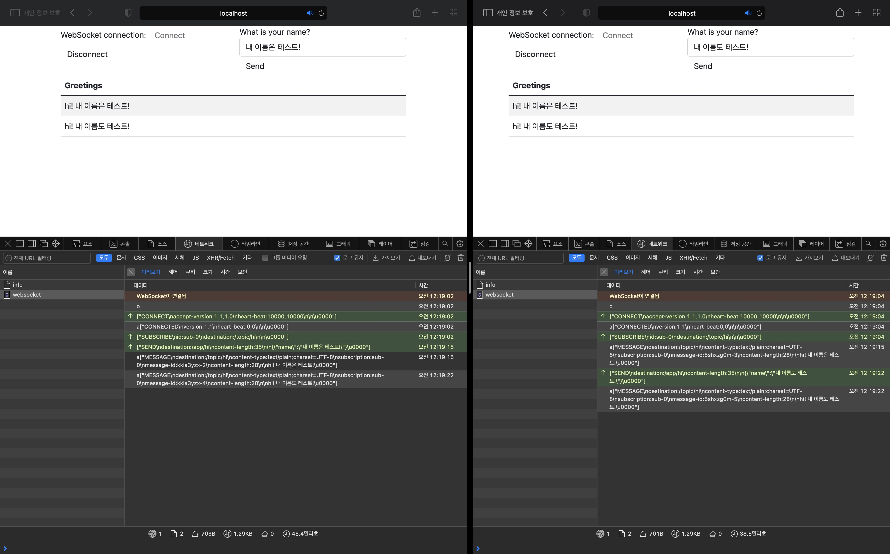
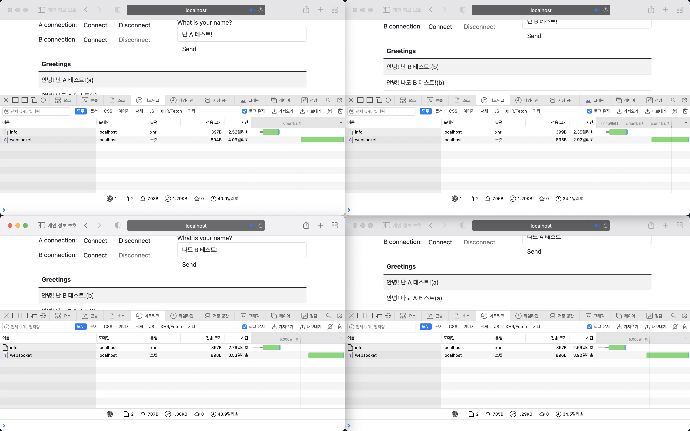

# Spring Chat Service with WebSocket, STOMP

## WebSocket

TCP 연결을 통해 클라이언트와 서버 사이에 전이중 양방향 통신 (full duplex, 2-way communication); <br/>
HTTP와 다른 TCP 방식으로 작동하지만, HTTP에서 동작 가능하도록 설계되었다. 

* ref : <https://stackoverflow.com/questions/16945345/differences-between-tcp-sockets-and-web-sockets-one-more-time>

HTTP Request를 그대로 사용하기 때문에 기존의 80, 443 포트로 접속을 하므로 추가 방화벽을 열지 않고도 양방향 통신이 가능하고, HTTP 규격인 CORS 적용이나 인증 등.. 과정을 기존과 동일하게 가져갈 수 있다.

### 연결 과정

우선, WebSocket interaction을 시작하기 위해서는 <code>Handshake</code>를 통해 protocol을 WebSocket 으로 변환해야한다.
이를 하기위해 HTTP 요청에 <code>update</code> header를 추가하여 WebSocket Protocol로 변환하는 작업이 필요하다.

< Switching protocol request >
```yaml
GET /localhost/something HTTP/1.1
Host: localhost:8080
Upgrade: websocket    -- 1 
Connection: Upgrade   -- 2 
Sec-WebSocket-Key: Uc9l9TMkWGbHFD2qnFHltg==
Sec-WebSocket-Protocol: v10.stomp, v11.stomp
Sec-WebSocket-Version: 13
Origin: http://localhost:8080
```

1. WebSocket 으로 변경
2. connection을 다른 protocol로 변경 ([ref](https://developer.mozilla.org/en-US/docs/Web/HTTP/Headers/Upgrade))

< Switching protocol response >
```yaml
HTTP/1.1 101 Switching Protocols 
Upgrade: websocket
Connection: Upgrade
Sec-WebSocket-Accept: 1qVdfYHU9hPOl4JYYNXF623Gzn0=
Sec-WebSocket-Protocol: v10.stomp
```

## WebSocket API

Spring에서는 Client-Side와 Server-Side에서 WebSocket을 사용할 수 있도록 도와주는 API를 제공한다.

< build.gradle >
```java 
implementation 'org.springframework.boot:spring-boot-starter-websocket'
```

< Config Class >
```java
@Configuration
@EnableWebSocket
public class WebSocketConfig implements WebSocketConfigurer {

	private static final String CHAT_WS_PATH = "/ws/v1/chat";

	@Override
	public void registerWebSocketHandlers (WebSocketHandlerRegistry registry) {
		registry.addHandler(chatWebSocketHandler(), CHAT_WS_PATH);
	}

	@Bean
	public WebSocketHandler chatWebSocketHandler() {
		return new ChatHandler();
	}

}
```

< WebSocket Handler >
```java
public class ChatHandler extends TextWebSocketHandler {

	@Override
	protected void handleTextMessage(WebSocketSession session, TextMessage message) throws Exception {
		super.handleTextMessage(session, message);
	}

}
```

다음과 같이 <code>TextWebSocketHandler</code> Class를 상속받아 Handler를 구성한 뒤 
<code>addHandler</code> 메소드를 통해 Configuration에 등록 시켜주면 쉽게 WebSocket Server를 구현할 수 있다.

이 외에도 <code>WebSocketHandler</code>나 <code>BinaryWebSocketHandler</code> 등.. 의 Handler를 상속을 수도 있다.

### Handshake

<code>WebSocketRegisterHandler</code>의 <code>addInterceptors</code> 메소드를 통해 Handshake의 Before와 After를 위한 메소드를 사용할 수 있다.

```java
register.addInterceptors(new HttpSessionHandshakeInterceptor());
```

실제로 <code>HttpSessionHandshakeInterceptor</code> 클래스 코드를 보면 <code>HandshakeInterceptor</code>를 상속받아
<code>beforeHandshake</code>와 <code>afterHandshake</code>를 Override 하여 구현한 것을 확인할 수 있다.

> HttpSessionHandshakeInterceptor <br/>
> 해당 Interceptor를 통해 HttpSession에 접속하고 해당 내용을 WebSocketHandler에 전달할 수 있다.

### Server Configuration

메세지 버퍼 크기, 유휴 시간 초과 등 런타임 특성을 <code>ServletServerContainerFactoryBean</code>를 통해 제어할 수 있다.

```java
@Bean
public ServletServerContainerFactoryBean createWebSocketContainer(){
    ServletServerContainerFactoryBean container = new ServletServerContainerFactoryBean();
    container.setMaxTextMessageBufferSize(8192);
    container.setMaxBinaryMessageBufferSize(8192);
    return container;
}
```

### Origins

Spring Framework 4.1.5를 기준으로 WebSocket의 기본동작은 동일한 오리진 요청만 수락하는 것이다.

<code>WebSocketRegisterHandler</code>의 <code>setAllowedOrigins</code> 메소드를 통해 Allow Origin을 설정할 수 있다.

```java
registry.setAllowedOrigins("*");

    or
        
registry.setAllowedOrigins("https://somedomain.com");
```

## SockJS

WebSocket 통신을 모든 브라우저에서 지원하지는 않는다. <br/>
Server와 Client 중간에 위치한 Proxy가 Upgrade헤더를 해석하지 못해 서버에 전달하지 못할 수 있으며 <br/>
오랜시간 Idle 상태로 지속된 Connection이 지워질 수 있다. 

이러한 경우 WebSocket을 대체하기위해 다른 방식을 사용하여 통신을 지속해야한다. 이때, <code>WebSocket Emulation</code>을 이용하여 
<code>Http Streaming</code>, <code>Long Pulling</code>과 같은 Http 기반의 방식으로 WebSocket과 같은 흉내를 낼 수 있다.

> Javascript 진영의 <code>Socket.io</code>와 같은 개념이다.

SockJS를 적용하기위해서는 Configuration에서 WebSocketHandler를 등록할때 <code>withSockJS()</code> 멤버 메소드를 사용하여 적용이 가능하다.

```java
@Override
public void registerWebSocketHandlers (WebSocketHandlerRegistry registry) {
    registry
            .addHandler(chatWebSocketHandler(), CHAT_WS_PATH)
            .setAllowedOrigins("*")
            .addInterceptors(new HttpSessionHandshakeInterceptor())
            .withSockJS();  // <- 적용
}
```

(더 다양한 환경에서 SockJS 설정방법은 아래 링크를 참고)

* ref : <https://docs.spring.io/spring-framework/docs/5.2.6.RELEASE/spring-framework-reference/web.html#websocket-fallback>

## STOMP 

<code>STOMP</code><sub><code>Simple Text Oriented Messaging Protocol</code></sub>는 메시지를 효율적으로 전송하기 위해 탄생한 프로토콜이다.
WebSocket 위에서 돌아가는 프로토콜이며 서버가 전송할 메시지의 유형, 형식, 내용을 정의하는 메커니즘이며 <code>pub/sub</code> 구조로 동작.

메시지 전송을 위한 프로토콜 (AMQP, MQTT, ..) 은 존재하지만 <code>STOMP</code>와 차이점은 Binary가 아닌 <code>Text 기반</code>의 프로토콜이라는 점이다.

* ref : <https://velog.io/@qkrqudcks7/STOMP란>
* ref : <https://warpgate3.tistory.com/entry/STOMPSimpleStream-Text-Oriented-Message-Protocol>

STOMP는 only WebSocket 만을 위한 프로토콜은 아니다. 다른 몇몇 양방향 통신에서도 활용가능하다. 
 
WebSocket은 Binary, Text 타입의 메시지를 주고 받을 수 있지만, 따로 형식이 정해진것은 아니다.
그렇기 때문에 따로 주고받을 메시지에 대한 형식을 정해야하며 파싱로직 또한 구현을 해줘야한다.

Spring에서 STOMP를 사용하면 좋은점은 다음과 같다.

1. 하위 프로토콜, 컨벤션을 따로 정의할 필요 없다.
2. 연결 주소마다 새로운 Handler를 구현하고 설정해줄 필요 없다.
3. Spring Security를 사용할 수 있다.
4. 외부 Messaging Queue를 사용할 수 있다.

* ref : <https://velog.io/@guswns3371/WebSocket-Spring>

### Frame

STOMP에서 통신 시 쓰이는 Frame은 다음과 같다

```
COMMAND         | SEND, SUBSCRIBE 등.. 명령
                |
header1:value1  | REST의 Header와 같이
header2:value2  | 부가 정보를 나타냄
                |
Body^@          | 매시지 내용
```

### Flow



```java
@Configuration
@EnableWebSocketMessageBroker
public class WebSocketBrokerConfig implements WebSocketMessageBrokerConfigurer {

	@Override
	public void configureMessageBroker(MessageBrokerRegistry registry) {
		registry.enableSimpleBroker("/queue","/topic");
		registry.setApplicationDestinationPrefixes("/app");
	}

	@Override
	public void registerStompEndpoints(StompEndpointRegistry registry) {
		registry.addEndpoint("/blar-blar")
				.withSockJS();
	}

}
```

Configuration Class에 <code>@EnableWebSocketMessageBroker</code> 적용과 <code>WebSocketMessageBrokerConfigurer</code> 상속을 해줌으로써
STOMP에 대한 설정을 할 수 있다. 

 - configureMessageBroker : Message Broker에 대한 설정이다.
   - enableSimpleBroker - 해당 메소드를 통해 내장 브로커를 사용할 수 있다.
     - 해당 메소드를 통해 prefix url을 설정해주면, prefix를 가진 url로 메시지가 발행될 때 브로커가 이를 처리해준다.
   - setApplicationDestinationPrefixes - Message Handler로 routing 되는 prefix url
 - registerStompEndpoints : WebSocket의 addHandler와 유사하다.
   - addEndpoint - 해당 메소드를 통해 WebSocket Handshaking이 진행된다.
   - withSockJS - WebSocket에서 withSockJS()와 동일하다.
 
* 단 registerStompEndpoints와 같은 경우 Configuration 에서 지정할 필요없이 <code>Controller</code>에서 지정이 가능하다

```java
@Controller
public class ChatController {

	@MessageMapping("/hi")
	@SendTo("/topic/hi")
	public String hi(String message) throws Exception {
		return "hi! " + message;
	}

}
```

<code>@MessageMapping</code>에 설정된 url을 호출 시 <code>Broadcast</code>로 보내지며, <br/>
<code>@SendTo</code>에 설정된 url을 호출 시 <code>Subscriber</code>에게 전달된다.

Client와 관련된 코드는 [여기](https://spring.io/guides/gs/messaging-stomp-websocket/) 에서 얻을 수 있었다

* ref : <https://velog.io/@guswns3371/WebSocket-Spring>



### Destination Variable

```java
@MessageMapping("hi/{to}")
public String hi(HiDto message) throws Exception {
    return "안녕! " + message.getName();
}
```

다음과 같이 <code>Placeholder</code>를 설정하여 보내고자하는 대상을 나눌 수 있다.

만약 <code>/topic/hi/a</code>를 subscribe 했다면 <code>app/hi/a</code>를 해야만 메시지를 얻을 수 있다.   
<code>app/hi/b</code>와 같이 발송을 했다면 메시지를 받지 못한다.

```java
@MessageMapping("hi/{to}")
public String hi(@DestinationVariable("to") String to, HiDto message) throws Exception {
    return "안녕! " + message.getName() + "(" + to + ")";
}
```

다음과 같이 <code>@DestinationVariable</code> 어노테이션으로 Parameter를 받는다면 <code>Placeholder</code>의 데이터를 변수를 통해 알 수 있다.

```java
@Override
public void configureMessageBroker(MessageBrokerRegistry registry) {
    registry.setPathMatcher(new AntPathMatcher("."));
    registry.enableSimpleBroker("/queue","/topic");
    registry.setApplicationDestinationPrefixes("/app");
}
```

Configuration 중, <code>setPathMatcher</code> 메소드를 통해 <code>'.'를 통해 분리한다</code>라는 설정을 해주면
path를 <code>@MessageMapping("hi.{to}")</code>와 같이 설정이 가능하다.

 * <code>@SendTo</code> 어노테이션은 해당 기능을 지원하지 않는다.

